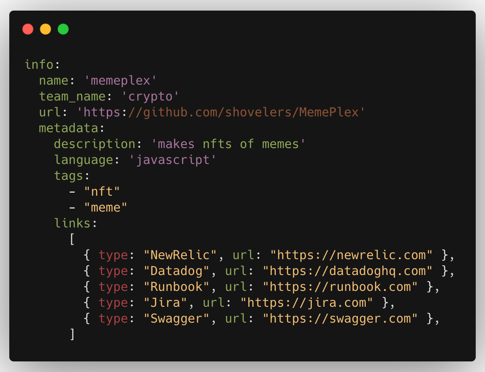

Any microservice that exists in your architecture can be registered as a service in Odet. A service belongs to a team and each one has the metadata stored corresponding to them.

---
### Metadata for a Service

The following metadata is stored for each service:
- **Name**: The name of the service
- **Repo Link**: The link to the source code repo for the service
- **Owner**: The team name that owns the service
- **Tags**: Tags that you want to assign to the service (can be used to
  filter services)
- **Links**: These are links to the various resources that are attached to a
  service like monitoring dashboards, documentations, etc.

### Service Creation & Updation

### Creation
1. [Create `odet.yml`](/blueprint/odet-yml)
2. Check it in the desired service repo
3. Setup the odet github action
4. Trigger the pipeline
once it passes, you would be able to see the service on Odet

### Update
`odet.yml` checked in your service repo is the source of truth for all the data.

If you want to edit the info of a service, just make the changes to the odet.yml file and run the pipeline.

### Anatomy of Odet.yml

